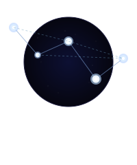

# Cosmos Mapper

<p align="left">
  
</p>

[](LICENSE)
[](https://nodejs.org/)
[](tests/)
[](tests/)
[](https://azure.microsoft.com/services/cosmos-db/)
[](https://github.com/)

Azure Cosmos DB schema documentation generator with ERD diagrams.

Automatically samples documents from your Cosmos DB containers, infers schemas, detects relationships, and generates industry standard, wiki-compatible, Markdown documentation with Mermaid ERD diagrams.

## Features

- **Schema Inference**: Samples documents and infers property types, optionality, and patterns
- **Type Detection**: Recognises GUIDs, dates, reference objects, lookup objects, and more
- **Relationship Detection**: Identifies foreign key-like relationships between containers
- **Confidence Scoring**: Calculates confidence scores for detected relationships with optional data validation
- **Cross-Database Support**: Detects relationships between containers across different databases
- **Mermaid ERD Diagrams**: Generates visual entity relationship diagrams (compatible with these tools: https://mermaid.js.org/ecosystem/integrations-community.html).

## Installation

```bash
npm install
```

## Configuration

Copy the example environment file and configure your Cosmos DB connection:

```bash
cp .env.example .env
```

Edit `.env` with your settings:

```env
# Option 1: Key-based authentication
COSMOS_ENDPOINT=https://your-account.azure.com:443/
COSMOS_KEY=your-primary-key [Read Only supported and strongly suggested]

# Option 2: Azure AD / Managed Identity
# Just set COSMOS_ENDPOINT and leave COSMOS_KEY empty

# Optional: Documents to sample per container (default: 100)
SAMPLE_SIZE=100
```

### Authentication Options

**Key-based**: Set both `COSMOS_ENDPOINT` and `COSMOS_KEY`

**Azure AD / Managed Identity**: Set only `COSMOS_ENDPOINT`. The tool uses `DefaultAzureCredential` which supports:
- Managed Identity (Azure VMs, App Service, etc.)
- Azure CLI (`az login`)
- Visual Studio Code
- Environment variables (`AZURE_CLIENT_ID`, `AZURE_STORE_ID`, `AZURE_CLIENT_SECRET`)

### Config File (Optional)

For more advanced configuration, create a `cosmosmapper.config.json` file:

```json
{
  "output": "./output",
  "sampleSize": 100,
  "databases": [],
  "containers": {
    "include": [],
    "exclude": ["*-archive", "*-backup", "test-*"]
  },
  "formats": ["markdown", "html"],
  "validation": {
    "enabled": false,
    "sampleSize": 1000
  }
}
```

| Option | Description | Default |
|--------|-------------|---------|
| `output` | Output directory for generated documentation | `./output` |
| `sampleSize` | Number of documents to sample per container | `100` |
| `databases` | Array of database names to include (empty = all) | `[]` |
| `containers.include` | Glob patterns for containers to include | `[]` (all) |
| `containers.exclude` | Glob patterns for containers to exclude | `[]` |
| `formats` | Output formats: `markdown`, `html` | `["markdown", "html"]` |
| `validation.enabled` | Query data to validate relationships | `false` |
| `validation.sampleSize` | FK values to sample for validation | `1000` |

See `cosmosmapper.config.example.json` for a template.

### CLI Arguments

Override config file settings via command line:

```bash
npm start -- --output ./docs --sample-size 50 --databases "db1,db2" --format markdown
```

| Argument | Description |
|----------|-------------|
| `--config <path>` | Path to config file (default: `cosmosmapper.config.json`) |
| `--output <dir>` | Output directory |
| `--sample-size <n>` | Documents to sample per container |
| `--databases <list>` | Comma-separated database names |
| `--format <list>` | Comma-separated output formats |
| `--validate` | Enable relationship data validation |
| `--no-validate` | Disable relationship data validation |
| `--snapshot [name]` | Save schema snapshot (optional custom name) |
| `--diff` | Compare against most recent snapshot |
| `--diff-from <id>` | Compare against specific snapshot |
| `--fail-on-breaking` | Exit with error code 1 if breaking changes found |

## Usage

```bash
npm start
```

Output is generated in the `./output/` directory.

## Output Structure

```
output/
├── index.md                 # Main overview with ERD
├── ecommerce-store/
│   ├── _overview.md         # Database ERD and container list
│   ├── products.md          # Container schema details
│   ├── orders.md
│   └── ...
├── ecommerce-platform/
│   ├── _overview.md
│   ├── stores.md
│   └── ...
└── _cross-database.md       # Cross-database relationships
```

## Type Detection

The tool detects and labels these types:

| Type | Detection |
|------|-----------|
| GUID | UUID format strings |
| DateTime | ISO 8601 date strings |
| DateTimeObject | `{ Value: "ISO string", Epoch: number }` |
| ReferenceObject | `{ Id: "guid", Name: "string", Code: "string" }` |
| LookupObject | `{ Id: number, Name: "string", Code: "string" }` |
| Integer | Whole numbers |
| Number | Decimal numbers |
| Boolean | true/false |
| Array | Arrays of any type |
| Object | Nested objects |

## Relationship Detection

Relationships are detected from:

- Properties ending in `Id` (e.g., `StoreId` → `stores`)
- Properties ending in `_id` (e.g., `product_id` → `products`)
- Nested objects with `Id` property (e.g., `Category.Id` → `categories`)
- Reference pattern objects

> **Note:** Unlike relational databases, Cosmos DB has no enforced foreign keys. Relationships shown in the ERD are **inferred from naming conventions**, not database constraints. Some detected relationships may be:
> - Denormalised copies (embedded snapshots) rather than live references
> - Pointing to containers with slightly different names than guessed
> - Application-level conventions that don't represent true data relationships
>
> Always verify critical relationships against your application code or domain knowledge.

## Relationship Confidence Scoring

Each detected relationship includes a confidence score (0-100%) indicating how likely it represents a real data relationship. The score is calculated from multiple factors:

### Confidence Factors

| Factor | Weight | Description |
|--------|--------|-------------|
| **Referential Integrity** | 45% | What percentage of FK values exist in the target container |
| **Type Consistency** | 20% | Whether FK and target ID types match |
| **Naming Pattern** | 20% | How well the property name matches the target container |
| **Frequency** | 15% | How often the FK field is populated |

### Confidence Levels

| Level | Score | Meaning |
|-------|-------|---------|
| **High** | 80-100% | Strong evidence of a real relationship |
| **Medium** | 60-79% | Likely a relationship, worth verifying |
| **Low** | 40-59% | Possible relationship, may be coincidental |
| **Very Low** | 0-39% | Unlikely to be a real relationship |

### Enabling Data Validation

By default, confidence is calculated using heuristics only (naming patterns, type matching). For more accurate scores, enable data validation to query actual FK values:

```bash
# Via CLI flag
npm start -- --validate

# Via environment variable
VALIDATE_RELATIONSHIPS=true npm start
```

Or in `cosmosmapper.config.json`:

```json
{
  "validation": {
    "enabled": true,
    "sampleSize": 1000
  }
}
```

### Configuration Options

| Option | Description | Default |
|--------|-------------|---------|
| `validation.enabled` | Enable data validation queries | `false` |
| `validation.sampleSize` | FK values to sample for integrity check | `1000` |
| `validation.weights` | Custom weights for confidence factors | See below |

Custom weights example:

```json
{
  "validation": {
    "enabled": true,
    "weights": {
      "referentialIntegrity": 0.50,
      "typeConsistency": 0.20,
      "frequency": 0.10,
      "namingPattern": 0.20
    }
  }
}
```

### Interpreting Results

In the HTML report, relationships display colour-coded confidence badges:
- 🟢 **Green** (High): Validated relationship with strong evidence
- 🟡 **Yellow** (Medium): Likely relationship, consider verifying
- 🔴 **Red** (Low): Weak evidence, may be false positive
- ⚪ **Grey** (Very Low): Probably not a real relationship

Hover over any relationship badge to see a detailed summary of the confidence factors.

## Schema Versioning & Change Detection

CosmosMapper can track schema changes over time by saving snapshots and comparing them against future runs.

### Saving Snapshots

Save the current schema as a snapshot for future comparison:

```bash
# Save with auto-generated timestamp ID
npm start -- --snapshot

# Save with a custom name
npm start -- --snapshot baseline
npm start -- --snapshot pre-migration
```

Snapshots are stored in `.cosmoscache/snapshots/` (configurable via `versioning.cacheDir`).

### Comparing Schemas

Compare the current schema against a previous snapshot:

```bash
# Compare against the most recent snapshot
npm start -- --diff

# Compare against a specific snapshot
npm start -- --diff-from baseline
```

This generates:
- Console output showing added/removed/changed properties
- `schema-changes.md` report in the output directory
- Breaking changes highlighted with warnings

### Breaking vs Additive Changes

Changes are classified as:

**Breaking (may affect consumers):**
- Properties removed
- Type narrowing (e.g., `string|number` → `string`)
- Required → optional changes
- Relationships removed

**Additive (safe):**
- New properties added
- Type widening (e.g., `string` → `string|null`)
- New relationships detected

### CI/CD Integration

For automated pipelines, use `--fail-on-breaking` to exit with error code 1 when breaking changes are detected:

```bash
npm start -- --diff --fail-on-breaking
```

### Configuration

```json
{
  "versioning": {
    "cacheDir": ".cosmoscache",
    "retention": 10,
    "failOnBreaking": false
  }
}
```

| Option | Description | Default |
|--------|-------------|---------|
| `cacheDir` | Directory for snapshot storage | `.cosmoscache` |
| `retention` | Number of unnamed snapshots to keep | `10` |
| `failOnBreaking` | Exit with error on breaking changes | `false` |

## Testing

Run the test suite:

```bash
npm test          # Watch mode
npm run test:run  # Single run
npm run test:coverage  # With coverage report
```

269 unit tests covering configuration, type detection, schema inference, relationship detection, confidence scoring, schema versioning, and output generation.

## Demo with Cosmos DB Emulator

You can test the tool locally using the Azure Cosmos DB Emulator:

### 1. Install the Emulator

```powershell
winget install Microsoft.Azure.CosmosEmulator
```

Or download from: https://aka.ms/cosmosdb-emulator

### 2. Seed Sample Data

```bash
npm run seed
```

This creates `ecommerce-store` and `ecommerce-platform` databases with synthetic e-commerce data (products, orders, customers, stores, suppliers, etc.).

### 3. Configure and Run

Update `.env` (or use the well-known emulator defaults):

```env
COSMOS_ENDPOINT=https://localhost:8081
COSMOS_KEY=C2y6yDjf5/R+ob0N8A7Cgv30VRDJIWEHLM+4QDU5DE2nQ9nDuVTqobD4b8mGGyPMbIZnqyMsEcaGQy67XIw/Jw==
```

Then run:

```bash
npm start
```

## License

MIT
